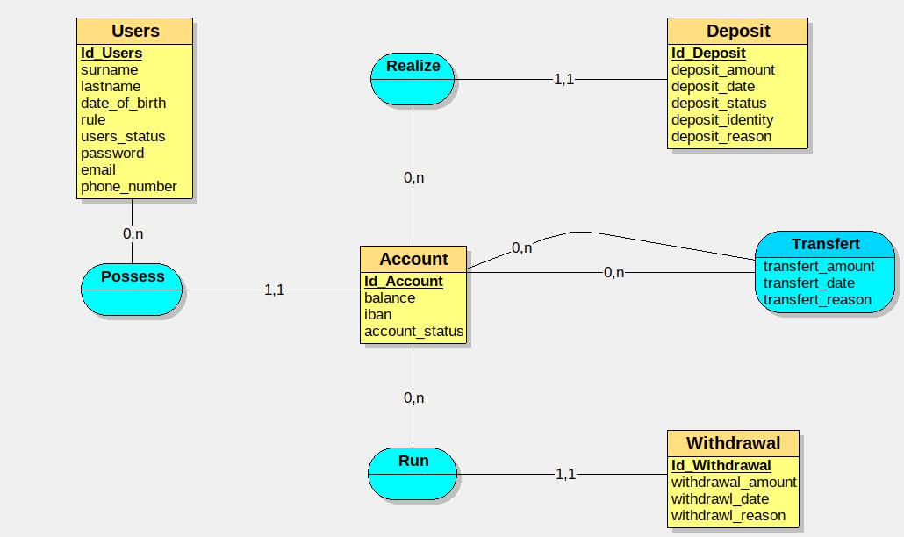
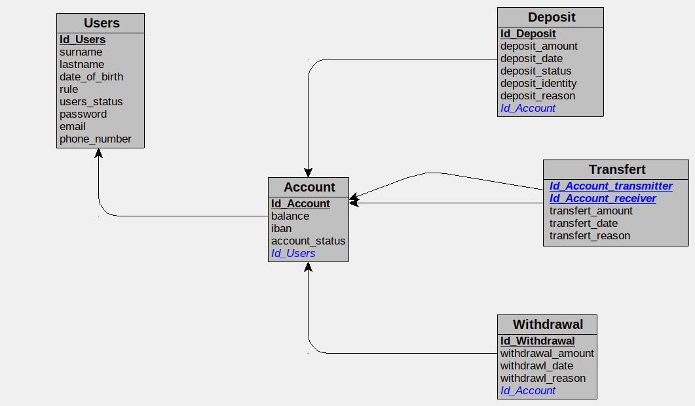
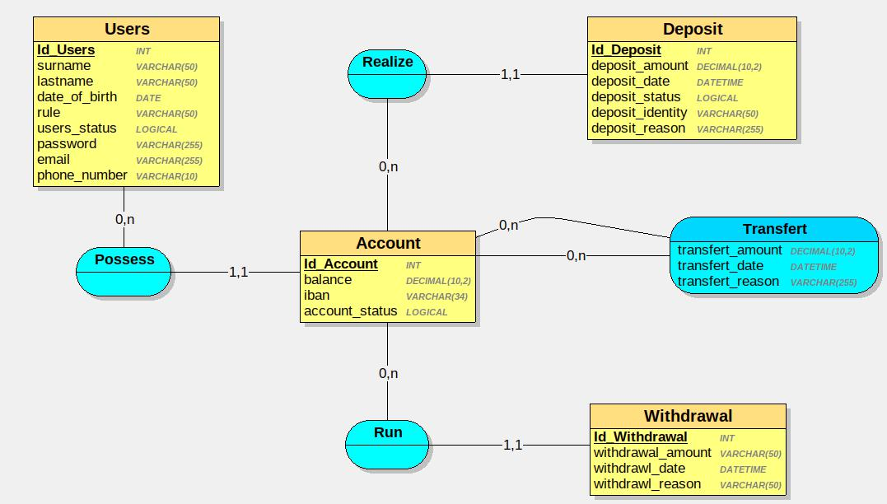
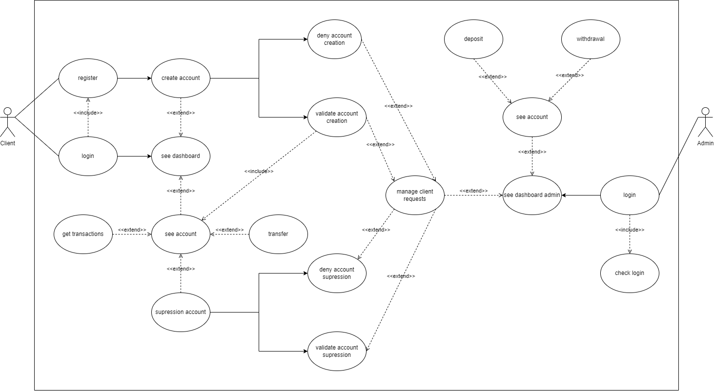
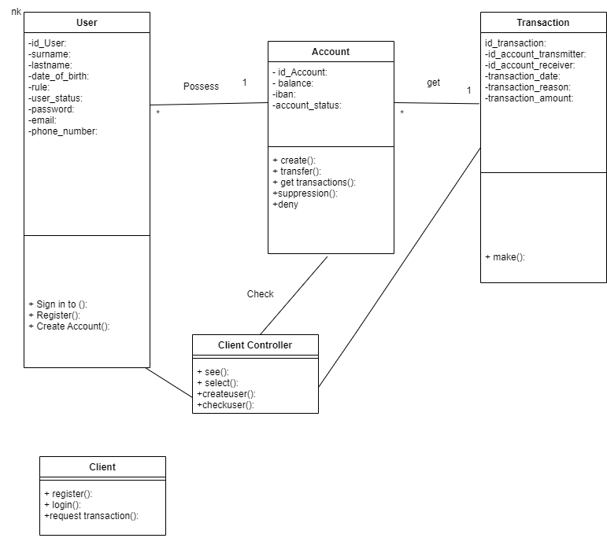
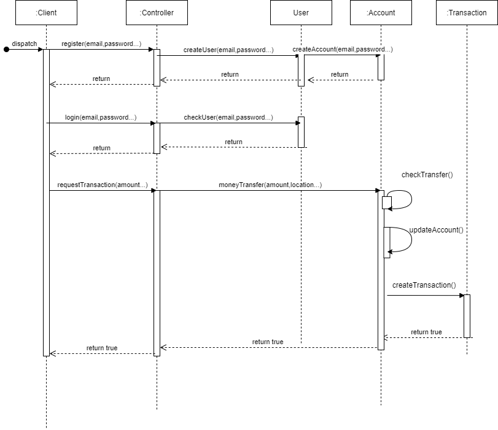

# Bank Root

## Table des matières

 1. [Contexte du projet](#contexte-du-projet)
 2. [Critères de performance](#critères-de-performance)
 3. [Livrable](#livrable)
 4. [Règles de gestion](#règles-de-gestion)
 5. [Dictionnaire de données](#dictionnaire-de-données)
 6. [Modèle Conceptuel des Données](#modèle-conceptuel-des-données)
 7. [Modèle Logique des Données](#modèle-logique-des-données)
 8. [Modèle Physique des Données](#modèle-physique-des-données)
 9. [UML (Unified Modeling Language)](#uml-unified-modeling-language)  
   9.1. [Diagramme use case](#diagramme-use-case)  
   9.2. [Diagramme de classe](#diagramme-de-classe)  
   9.3. [Diagramme de séquence](#diagramme-de-séquence)
 10. [Stratégie de sécurisation](#stratégie-de-sécurisation)
 11. [Trello du projet](#trello-du-projet)
 12. [Maquette du projet](#maquette-du-projet-figma)
 13. [Installation du projet](#installation-du-projet)
 14. [Sources](#sources)

## Contexte du projet

Vous êtes développeur junior au sein du service informatique d’une enseigne bancaire nommée Bank Root.

Le coeur de cible de cette banque était jusqu’à maintenant de proposer des services bancaires sur site.

Elle souhaite maintenant diversifier sa clientèle, entrer de plein pied dans l’ère du numérique ( kek …) et (ENFIN) proposer à ses usagers un service bancaire en ligne renouvelé afin d’attirer de nouveaux utilisateurs et moderniser son offre.

La mission de votre équipe est de concevoir une application qui permet à votre employeur la gestion de ses comptes bancaires en ligne dans un premier temps et dans un second temps de proposer des services de gestion bancaire à vos clients (dépôts, virements, etc …).

## Critères de performance

**Une API fonctionnelle doit être fournie avec la possibilité que:**

- A chaque client correspond un compte avec un numéro unique (one to many)
- Chaque compte peut être débiteur ou créditeur
- Chaque compte peut faire des retraits ou dépôts
- Des transactions peuvent être effectuer entre tous les comptes via un formulaire, les -montants doivent être correctement réaffectés.
- Un dashboard permet de voir le listings de tous les comptes avec leur soldes
- Chaque compte doit avoir une page avec les transactions

**Technos utilisées:**

- Database : PostgreSQL
- ORM Prisma ou celui fourni de base par le framework de votre choix
- Framework : selon choix du groupe (Nest, Fastify, Koa ou AdonisJS)
- Moteur de templating : selon le framework (Pug, EJS, etc …)

**Optionnel:**

- 2 types de comptes : admin et client
- Chaque client aura son espace dédié
- Pour chaque compte le client peut cliquer sur un lien pour demander la suppression de son compte (validée uniquement par un admin).
- Pour chaque compte le client peut via un formulaire faire un retrait d’argent.
- Pour chaque compte le client peut via un formulaire faire virement vers un autre compte
- Pour chaque compte le client peut via un formulaire faire un dépôt d’argent
  - Option : Le crédit est validé par un admin

## Livrable

- [x] UML complet (use case, classes et séquences),
- [x] Un repo Github correctement agencé,
- [x] Des commits clairs et détaillés,
- [x] Un readme clair, complet et agréable à la rétine,
- [x] Un Jira reprenant toutes les différentes étapes du projet,

## Règles de gestion

### Client

- Contient des données client (nom, prénom âge )
- Le client peut avoir un pour plusieurs comptes.
- Le client a un espace dédié (regarder son compte dashboard )).
- Le client peut faire un dépôt d'argent ou le retrait.
- Le client peut faire un virement vers un compte.
- Le client peut de demande  la suppression de son compte.
- Le crédit est validé par un admin.
- Un client peut s'inscrire.

### Compte

- Un compte peut être créditeur ou débiteur (solde + ou solde -).
- Un compte peut faire un retrait ou des dépôts .
- Contient un solde et un numéro de compte.

### Admin

- Contient des données clients et admin (nom, prénom, ...etc).
- Un admin peut gérer un ou plusieurs clients.
- Un admin peut valider la suppression de compte.
- Un admin peut valider des dépôts d'argents.
- Un admin peut valider l'inscription d'un client.
- Un admin peut valider l'ajout ou la suppression d'un compte client.
- Tous dépôts sont validés par l'admin.
- L'admin crée le compte du client (envoie d'identifiant de co par mail).
- L'admin peut validé ou refusé un dépôt.

## Dictionnaire de données

| Code mnémonique  | Désignation                            | Type | Taille | Remarque                      |
| ---------------- | -------------------------------------- | ---- | ------ | ----------------------------- |
| nom              | nom de l'utilisateur                   | A    | 50     |                               |
| prenom           | prénom de l'utilisateur                | A    | 50     |                               |
| email            | email de l'utilisateur                 | AN   | 150    |                               |
| date_naissance   | date de naissance de l'utilisateur     | DATE | 10     | Au format AAAA-JJ-MM          |
| mot_de_passe     | mot de passe de hashé de l'utilisateur | AN   | 255    |                               |
| etat_utilisateur | état de l'utilisateur                  | L    |        |                               |
| role             | rôle de l'utilisateur                  | AN   | 1      |                               |
| solde_compte     | solde du compte                        | AN   | 10     |                               |
| iban             | iban du code                           | AN   | 34     |                               |
| etat_compte      | etat du code                           | L    |        |                               |
| montant_virement | montant du virement                    | AN   | 10     |                               |
| date_virement    | date du virement                       | DATE | 10     | Au format AAAA-JJ-MM HH:mm:ss |
| motif_virement   | motif du virement                      | AN   | 150    |                               |
| montant_depot    | montant du depot                       | AN   | 10     |                               |
| identite_depot   | identite du depot                      | A    | 100    |                               |
| motif_depot      | motif du depot                         | AN   | 150    |                               |
| date_depot       | date du depot                          | DATE | 10     | Au format AAAA-JJ-MM HH:mm:ss |
| date_retrait     | date du retrait                        | DATE | 10     | Au format AAAA-JJ-MM HH:mm:ss |
| montant_retrait  | montant du retrait                     | AN   | 10     |                               |
| motif_retrait    | motif du retrait                       | AN   | 150    |                               |

## Modèle Conceptuel des Données

Cliquer sur le MCD pour l'atteindre :

[](./Docs/Database/mcd.jpg)

## Modèle Logique des Données

**Modèle Logique des Données textuel:**

**Users** = (**Id_Users** INT, surname VARCHAR(50), lastname VARCHAR(50), date_of_birth DATE, rule VARCHAR(50), users_status LOGICAL, password VARCHAR(255), email VARCHAR(255), phone_number VARCHAR(10));
**Account** = (**Id_Account** INT, balance DECIMAL(10,2), iban VARCHAR(34), account_status LOGICAL, **#Id_Users**);
**Deposit** = (**Id_Deposit** INT, deposit_amount DECIMAL(10,2), deposit_date DATETIME, deposit_status LOGICAL, deposit_identity VARCHAR(50), deposit_reason VARCHAR(255), **#Id_Account**);
**Withdrawal** = (**Id_Withdrawal** INT, withdrawal_amount VARCHAR(50), withdrawl_date DATETIME, withdrawl_reason VARCHAR(50), **#Id_Account**);
**Transfert** = (**#Id_Account_transmitter**, **#Id_Account_receiver**, transfert_amount DECIMAL(10,2), transfert_date DATETIME, transfert_reason VARCHAR(255));

Cliquer sur le MLD pour l'afficher :

[](./Docs/Database/mld.jpg)

## Modèle Physique des Données

Cliquer sur le MPD pour l'afficher :

[](./Docs/Database/mpd.jpg)

## Script SQL

```sql
CREATE TABLE Users(
   Id_Users INT,
   surname VARCHAR(50) NOT NULL,
   lastname VARCHAR(50) NOT NULL,
   date_of_birth DATE NOT NULL,
   rule VARCHAR(50) NOT NULL,
   users_status LOGICAL NOT NULL,
   password VARCHAR(255) NOT NULL,
   email VARCHAR(255) NOT NULL,
   phone_number VARCHAR(10) NOT NULL,
   PRIMARY KEY(Id_Users)
);

CREATE TABLE Account(
   Id_Account INT,
   balance DECIMAL(10,2) NOT NULL,
   iban VARCHAR(34) NOT NULL,
   account_status LOGICAL NOT NULL,
   Id_Users INT NOT NULL,
   PRIMARY KEY(Id_Account),
   FOREIGN KEY(Id_Users) REFERENCES Users(Id_Users)
);

CREATE TABLE Deposit(
   Id_Deposit INT,
   deposit_amount DECIMAL(10,2) NOT NULL,
   deposit_date DATETIME NOT NULL,
   deposit_status LOGICAL NOT NULL,
   deposit_identity VARCHAR(50) NOT NULL,
   deposit_reason VARCHAR(255) NOT NULL,
   Id_Account INT NOT NULL,
   PRIMARY KEY(Id_Deposit),
   FOREIGN KEY(Id_Account) REFERENCES Account(Id_Account)
);

CREATE TABLE Withdrawal(
   Id_Withdrawal INT,
   withdrawal_amount VARCHAR(50) NOT NULL,
   withdrawl_date DATETIME NOT NULL,
   withdrawl_reason VARCHAR(50) NOT NULL,
   Id_Account INT NOT NULL,
   PRIMARY KEY(Id_Withdrawal),
   FOREIGN KEY(Id_Account) REFERENCES Account(Id_Account)
);

CREATE TABLE Transfert(
   Id_Account_transmitter INT,
   Id_Account_receiver INT,
   transfert_amount DECIMAL(10,2) NOT NULL,
   transfert_date DATETIME NOT NULL,
   transfert_reason VARCHAR(255) NOT NULL,
   PRIMARY KEY(Id_Account_transmitter, Id_Account_receiver),
   FOREIGN KEY(Id_Account_transmitter) REFERENCES Account(Id_Account),
   FOREIGN KEY(Id_Account_receiver) REFERENCES Account(Id_Account)
);
```

## UML (Unified Modeling Language)

### Diagramme use case

Cliquer sur le diagramme pour l'afficher :

[](./Docs/UML/usecase/use-case-diagram.png)

### Diagramme de classe

Cliquer sur le diagramme pour l'afficher :

[](./Docs/UML/class/class-diagram.png)

### Diagramme de séquence

Cliquer sur le diagramme pour l'afficher :

[](./Docs/UML/sequence/sequence-diagram.png)

## Stratégie de sécurisation

L'application se doit être **imperméable** au niveau des menaces et des vulnérabilités.En effet,les attaques peuvent apparaître dès la conception du site.Il est donc nécessaire de la mettre en place dès le début du projet et de considérer les besoin en sécurité.Cette considération permettra  d'avoir un suivi chronologique des éléments de sécurités à mettre en place.Il doit prendre en compte par ailleurs l'intégrité de son comportement en garantissant un accès web sécurisé et surtout protéger ses utilisateurs des menaces.

Dans notre approche de conception du site nous avons décidé d’utiliser le framework Symfony.En effet, ce dernier  comprends des fonctionnalités de sécurité **robuste**.Dans un premier temps, Symfony nous garanti une protection contre les injections.Par son aspect nous avons mis en place des contraintes de validations.

De ce fait ,tous nos inputs que ce soit champs de formulaires login etc  ont été filtrés.
Par extension, l’utilisation de Doctrine nous permet une protection à minima sur les requêtes dites classiques sur des objets.

Un système de **hachage** des mots de passe a été mis en place garantissant une sécurité supplémentaire en base de données.Cette politique des mots de passe renforcée nous permet d’agir face au attaque **brute-force** ou attaque par dictionnaire.

## Trello du projet

Nous avons mis en place un [Trello](https://trello.com/b/TBbPb6ry/watery-avalanche) pour faciliter la collaboration d'équipe
## Maquette du projet (Figma)

Nous avons également utilisé Figma pour créer le design front de notre projet qui se trouve [Ici](https://www.figma.com/file/t2bJbTkfUYw3hWaXzyLx6R/Untitled?node-id=0%3A1)

## Installation du projet

### Set-up le projet

Cloner le projet sur votre PC et lancez la commande ` composer install ` via un terminal de commande dans le dossier du projet.

### Configurer postgresql

Il faut installer [postgresql]([12:23https://www.postgresql.org/download/) et configurer le lien dans le fichier .env

### Lancer le serveur Symfony

Faites la commande `symfony serve --no-tls` pour lancer le serveur Symfony et rendez-vous sur ` https://127.0.0.1:8000/api ` pour vérifier la bonne installation sur projet

## Sources

### sites internet

- https://ineumann.developpez.com/tutoriels/merise/initiation-merise/  
- https://creately.com/blog/fr/uncategorized-fr/tutoriel-sur-les-diagrammes-de-classe/  
- http://grand.patrice.free.fr/net/courscharp/chap4/
- https://www.vaadata.com/blog/fr/la-securite-sur-symfony-episode-1-injection-xss-auth/
- https://api-platform.com/
- https://symfony.com/doc/current/index.html
- https://www.figma.com/fr/?utm_source=google&utm_medium=cpc&utm_campaign=17451562537&utm_term=figma&utm_content=603062771276&gclid=Cj0KCQjwnP-ZBhDiARIsAH3FSRejHEoEWYCrQYnVh4DmMBKVzC68mMGst-ZhLTrHGoJFDLIFcF_k3eQaApTBEALw_wcB

### Vidéos youtube

- https://www.youtube.com/watch?v=GC5BdRve38A&ab_channel=DelphineLonguet  
- https://www.youtube.com/watch?v=8VMMu-vcF60&t=407s&ab_channel=DelphineLonguet  
- https://www.youtube.com/watch?v=fPm5NrvmXHc&t=771s&ab_channel=DelphineLonguet  

*Ce projet a été réalisé en travail de groupe par :*

- ***Yacine Ponsot***
- ***Arias Ravelo***
- ***Dylan Butelle***
- ***Florian La***
